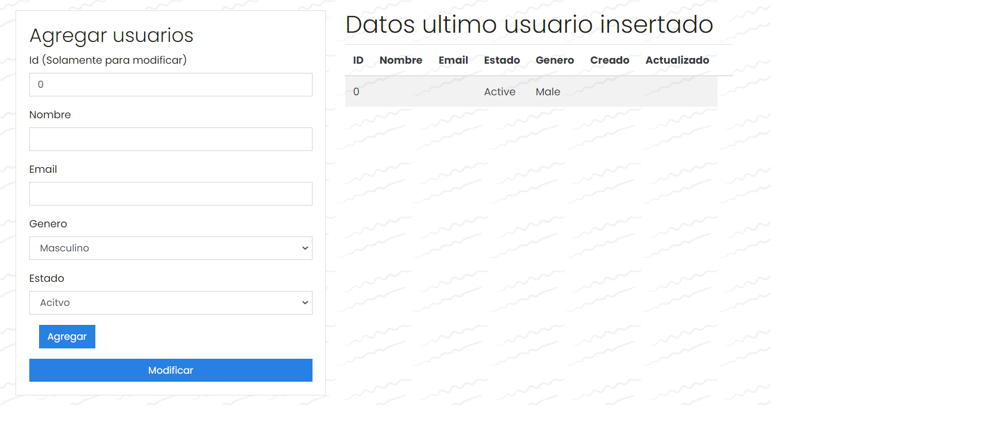
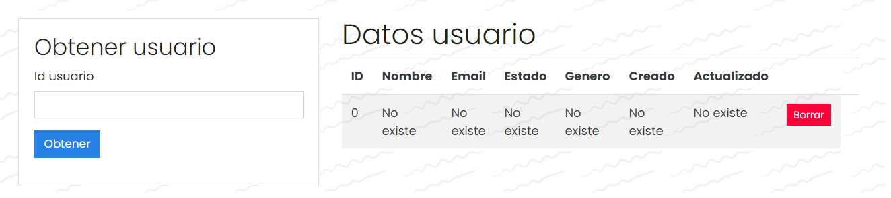
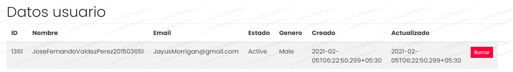

# Practica 1

Este proyecto es un cliente de webservice en el cual se consumen los servicios API REST de [GO REST](https://gorest.co.in/), fue elaborado con React - Redux.

## Ejecutar el programa

En el directorio del programa se debe de ejecutar en la terminal:

### `npm install`

Este comando descargara todas las librerias necesarias para ejecutar la aplicacion.

### `npm start`

Abrir [http://localhost:3000](http://localhost:3000) para visualizar la aplicacion den el navegador.

## Librerias utilizadas
+ [Axios](https://github.com/axios/axios) 
+ [Bootstrap](https://getbootstrap.com/)
+ [Redux](https://es.redux.js.org/)

## Interfaz de la aplicacion

**Nota: el token de acceso utilizado es temporal y puede cambiar en el futuro**

### Agregar/Modificar usuario
Para agregar un usuario se debe de completar la informacion del formulario y presionar el boton para agregar, siguiendo el mismo proceso para modificar

 

### Eliminar/Visualizar usuario
Para visualizar un usuario simplemente se debe de ingresar su id y presionar el boton de obtener

 

### Dato de usuario agregado		

 

